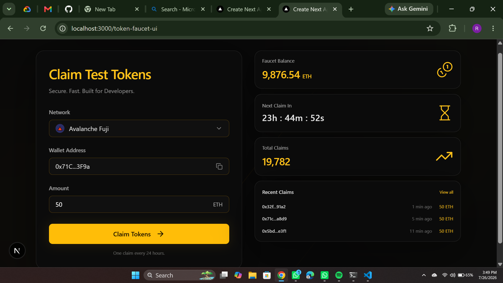

# Web3 Token Faucet

A decentralized application (dApp) developed as the final capstone project for the Web3 & Blockchain Development Techcruch C7 This project provides a seamless interface for developers to request test tokens on the Sepolia testnet to support their smart contract development and testing workflows.

## Project Overview
The Token Faucet addresses the common hurdle developers face when accessing testnet liquidity. By creating a controlled, smart-contract-backed distribution system, we ensure reliable access to test assets. The project features a full-stack integration between a Solidity-based smart contract backend and a responsive Next.js frontend.

## Team
- **Team Lead:** Ayobami (GitHub:Ayobami160)
- **Team Members:** Jessica And Chuksemma.

## Key Features
- **Wallet Integration:** Seamless connection with MetaMask via [RainbowKit/Wagmi/Ethers.js].
- **Automated Faucet Logic:** Secure token distribution governed by smart contract rules.
- **Real-time Monitoring:** Dashboard to view faucet balance, claim status, and transaction history.
- **Optimized UI:** A modern, dark-themed responsive interface built with Next.js and Tailwind CSS.
- **Testnet Verified:** Deployed and fully operational on the Sepolia testnet.

## Deployed Contract Addresses (Sepolia Testnet)
* **Token Faucet Contract:** [0x73f8c388064bc9e3ec52f16ec76922691ec92072](https://sepolia.etherscan.io/address/0x73f8c388064bc9e3ec52f16ec76922691ec92072)
* **ERC-20 Token Contract:** [0x7a81ee5c29ec574fbcee6d9da74ac070a5200ead](https://sepolia.etherscan.io/address/0x7a81ee5c29ec574fbcee6d9da74ac070a5200ead)  
*   **Network:** Sepolia Testnet

## Getting Started

### Prerequisites
Before running the project, ensure you have the following installed:
- [Node.js](https://nodejs.org/) (v18.0.0 or higher)
- [npm](https://www.npmjs.com/) or [yarn](https://yarnpkg.com/)
- [MetaMask](https://metamask.io/) browser extension

### Installation & Local Setup
1. **Clone the repository:**
   ```bash
   git clone [https://github.com/Ayobami160/tcc7-t4-token-faucet.git](https://github.com/Ayobami160/tcc7-t4-token-faucet.git)
   cd tcc7-t4-token-faucet
 
### Project Interface
